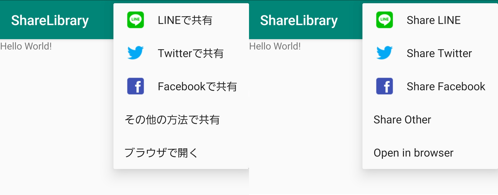
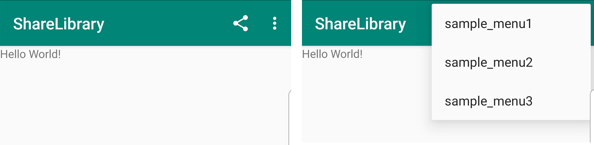

# ShareLibrary


## Description
Add Share menu to Android Actionbar.


## Language
Java

## Requirements
androidX

## Getting Started
- Add it in your root build.gradle at the end of repositories.
```java
	allprojects {
		repositories {
			...
			maven { url 'https://jitpack.io' }
		}
	}
```

- Add the dependency.
```java
	dependencies {
		implementation 'com.github.soushu:ShareLibrary:0.2.1'
	}
```

- Extends ShareMenuActivity.
```java
public class MainActivity extends ShareMenuActivity {
```

- Set webView with setWebView()
```java
        setWebView(webview);
```

- If necessary, set the title of the bar with setTitle()
```java
        setTitle("ShareLibrary");
```

- If you want to share not only the URL but also the app information, set the app name with setAppName() to add a link to the PlayStore.
```java
        setAppName("SampleApp");
```

- If you want the icon color to be white, use setColor(). The default is black.
```java
        setColor("white");
```

- If you want to add a menu separately, you can add it with onCreateOptionsMenu with menu add.

