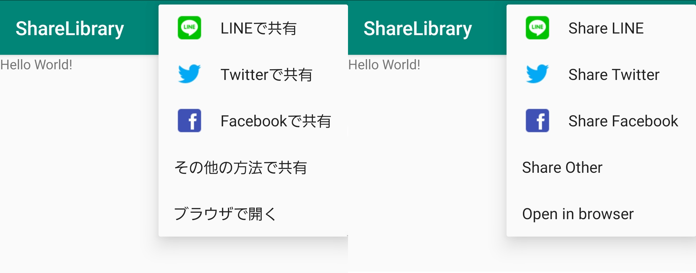
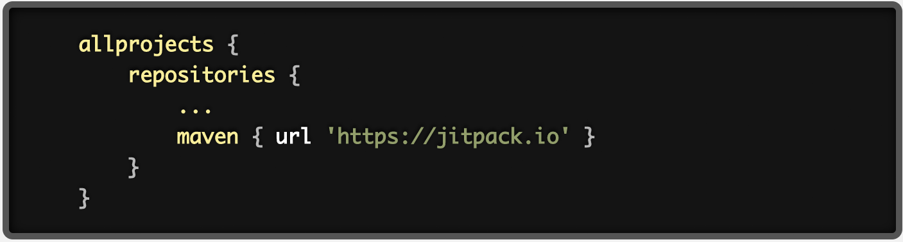
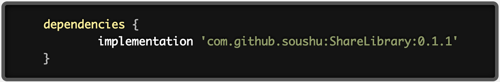
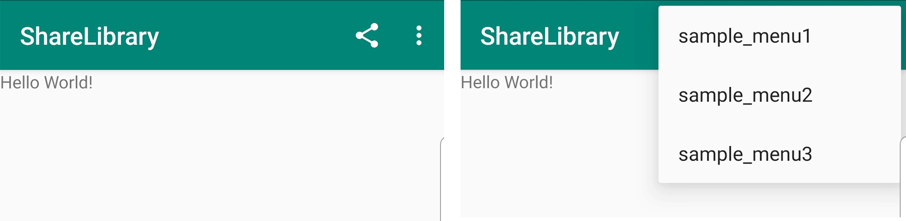

# ShareLibrary

## Description
Add Share menu to Android Actionbar.

## Language
- Android: Java

## Requirements
androidX

## Getting Started
- Add it in your root build.gradle at the end of repositories.

- Add the dependency.

- Extends ShareMenuActivity.

- Set webView with setWebView()

- If necessary, set the title of the bar with setTitle()

- If you want to share not only the URL but also the app information, set the app name with setAppName() to add a link to the PlayStore.

- If you want the icon color to be white, use setColor(). The default is black.

- If you want to add a menu separately, you can add it with onCreateOptionsMenu with menu add.

